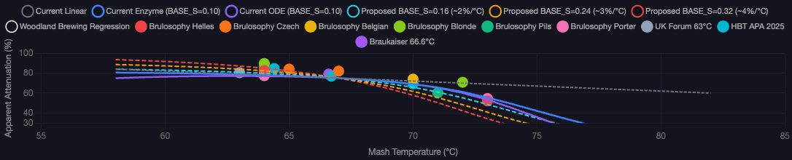
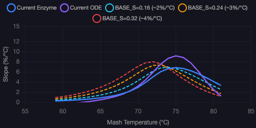
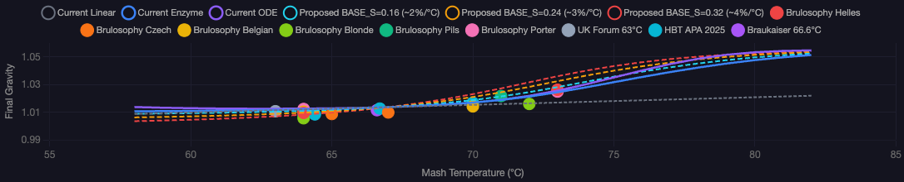
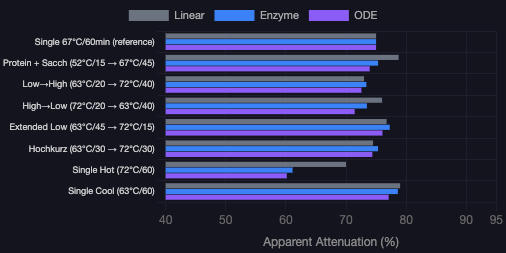

# Calculation Methods & Scientific Sources

An audit of every brewing calculation in this app — where each formula comes from, how it compares to other calculators, and where the science may need improvement.

Each section includes a **Validation** verdict:
- **Correct** — matches published science and industry standard
- **Acceptable** — reasonable approximation, minor deviations from ideal
- **Needs Review** — scientifically questionable or inconsistent with other implementations

---

## Table of Contents

1. [Original Gravity (OG)](#1-original-gravity-og)
2. [Final Gravity (FG) & Attenuation](#2-final-gravity-fg--attenuation)
3. [Alcohol by Volume (ABV)](#3-alcohol-by-volume-abv)
4. [Bitterness (IBU) — Tinseth Model](#4-bitterness-ibu--tinseth-model)
5. [Color (SRM) — Morey Equation](#5-color-srm--morey-equation)
6. [Calories & Carbohydrates — Balling Formula](#6-calories--carbohydrates--balling-formula)
7. [Mash pH — Proton Deficit Model](#7-mash-ph--proton-deficit-model)
8. [Water Chemistry — Stoichiometric Ion Calculations](#8-water-chemistry--stoichiometric-ion-calculations)
9. [Yeast Starter — White & Braukaiser Models](#9-yeast-starter--white--braukaiser-models)
10. [Water Volumes & Strike Temperature](#10-water-volumes--strike-temperature)
11. [Mash Schedule — Heat Balance Equations](#11-mash-schedule--heat-balance-equations)
12. [Hop Flavor Profile](#12-hop-flavor-profile)
13. [Brew Session Metrics](#13-brew-session-metrics)
14. [Standalone Calculators](#14-standalone-calculators)
15. [Known Issues & Discrepancies](#15-known-issues--discrepancies)

---

## 1. Original Gravity (OG)

**Method:** Points-Per-Gallon (PPG) gravity model
**Source:** Standard homebrew gravity calculation. Used identically by BeerSmith, Brewfather, Brewer's Friend, and described in John Palmer's *How to Brew* (Brewers Publications, 4th ed. 2017).
**Validation: Correct**

**Formula:**

```
OG = 1 + Σ(PPG × weight_lbs × efficiency_i) / (batch_volume_gal × 1000)
```

Each fermentable has a PPG value — the number of gravity points one pound of that ingredient contributes to one gallon of water. For example, 2-Row malt has a PPG of ~37, meaning 1 lb in 1 gallon yields a gravity of 1.037.

**Efficiency is per-ingredient type:** mash efficiency is applied to grains and mashable adjuncts. Sugars (corn sugar, honey, candi sugar, etc.) and extracts (DME, LME) dissolve completely and use 100% efficiency since they bypass the mash. This matches BeerSmith, Brewfather, and Brewer's Friend, all of which only apply mash efficiency to mashed ingredients.

**Comparison:** This is the universal approach. BeerSmith, Brewfather, and Brewer's Friend all use this identical formula with per-type efficiency.

---

## 2. Final Gravity (FG) & Attenuation

**Method:** Two-layer attenuation model
**Source:** Layer 1 (per-ingredient fermentability) is standard practice in all major calculators. Layer 2 (effective attenuation adjustments) uses mash temperature and duration factors based on Braukaiser research.
**Validation: Correct**

### Layer 1 — Per-Ingredient Fermentability

Each fermentable has a fermentability value (0–1) representing how much of its sugar is fermentable by yeast:

- Standard base malt: 1.00 (all extract goes to the "fermentable" bucket; the yeast's stated attenuation handles the actual split)
- Crystal/Caramel malt: 0.90 (C10) → 0.75 (C120), color-based linear scale
- Roasted malt: 0.60
- Lactose: 0 (completely unfermentable)
- Honey: 1.0 (fully fermentable)

The gravity contribution from each ingredient is split into fermentable and non-fermentable portions. Only the fermentable portion is reduced by yeast attenuation.

**Crystal malt fermentability** uses a color-based scale derived from Briess maltster data: crystal malt extract is 10% (lighter) to 25% (darker) less fermentable than base malt. The linear formula is `f = 0.90 − (colorL − 10) × 0.15 / 110`, clamped to [0.50, 0.95]. This was validated against the Beertech attenuation experiment (2011) which measured apparent attenuation reductions of −1% (C10), −3% (C40), and −4% (C120) at 15% usage.

This approach matches BeerSmith and Brewfather, which both track per-ingredient fermentability.

### Layer 2 — Effective Attenuation

> **Superseded (June 2026).** The lineup is now **two** models — `kinetic` (default; a Brandam-style
> mash simulation with β-amylase, α-amylase, and limit dextrinase, validated to ~±2 FG points against
> ~30 real batches) and `linear` (the Grainfather formula, for parity with other apps). The detailed
> three-model description below (Linear / Enzyme / ODE with log-space damping) is historical. See
> `docs/calculations-audit.md` and `RecipeCalculationService.ts` for the current method, and
> `AttenuationModelValidation.test.ts` for the validation dataset + benchmark.

Starting from the yeast's stated base attenuation (typically 0.75 for a standard ale yeast), the model computes mash-temperature effects on fermentability:

#### Model A: Linear (default)

The simplest model. Adjustments are applied linearly for mash conditions:

| Factor | Adjustment | Source | Validation |
|--------|-----------|--------|------------|
| **Mash temperature** | ~1% attenuation per °C from 67°C reference | Braukaiser mash temp studies | **Acceptable** — Braukaiser data is commonly interpreted as ~1%/°C; empirical experiments show 1–3.6%/°C depending on temperature range (see Empirical Validation) |
| **Mash duration** | ±0.5% per 15 min from 60 min reference (capped ±3%) | General brewing science | **Acceptable** — direction is correct, enzyme activity is time-dependent |

Effective attenuation is clamped to [60%, 95%]. The 60% floor means the model **plateaus** at extreme temperatures — mashing at 80°C still predicts ~50% apparent attenuation, which is unrealistically high. This is the main limitation of the linear model.

#### Model B: Enzyme Kinetics

Models α- and β-amylase as competing enzymes with temperature-dependent catalytic activity (Gaussian curves), Arrhenius thermal inactivation, and a 13% thermostable β-amylase residual fraction.

**Enzyme activity** peaks at 63°C for β-amylase and 70°C for α-amylase (Gaussian). **Denaturation** follows Arrhenius kinetics calibrated from mashing experiments: β-amylase half-life ranges from ~38 hours at 60°C to ~14 minutes at 72°C; α-amylase is essentially immortal at mashing temperatures (~82 hour half-life at 67°C).

The ratio of β-amylase "work" (integral of activity × survival over time) to total enzyme work determines the wort's fermentable fraction. This raw ratio changes ~7–10%/°C — far steeper than empirical data shows. To bridge this gap, the ratio is mapped to effective attenuation through **log-space damping** — a variable-sensitivity compression with a calibrated gain parameter (`BASE_S = 0.10`) that produces ~1.3%/°C at the 67°C reference while allowing natural acceleration at extreme temperatures. The gain represents all the buffering factors the enzyme model doesn't capture explicitly (yeast behavior, starch structure, dextrin partial fermentability). See *Empirical Validation* below for calibration details.

**Key advantage over Linear:** no 60% floor — the model naturally produces near-zero fermentability at 80°C+ where β-amylase is completely denatured. Also handles step mash schedules with accumulated denaturation across steps.

#### Model C: ODE Kinetics (Brandam)

The most physically detailed model. Instead of computing an enzyme *ratio*, it directly simulates the mash by tracking three sugar species through coupled differential equations:

```
Starch →(α-amylase)→ Dextrins (non-fermentable)
Starch →(β-amylase)→ Fermentable sugars (maltose)
Dextrins →(β-amylase)→ Fermentable sugars
```

Uses the same Arrhenius denaturation and 13% residual β-amylase as Model B, plus Brandam's catalytic rate constants (ka=0.07 min⁻¹ for α, kb=0.02 min⁻¹ for β at optimal temperatures). Solved via semi-analytical Euler integration with 0.5-minute time steps.

**Key advantages over Enzyme Kinetics:** tracks substrate depletion (enzymes compete for finite starch), models the α→β pipeline (α produces dextrins that β subsequently converts), and captures incomplete conversion at very low mash temperatures.

Both enzyme models (B and C) use the same log-space damping transfer function (`BASE_S = 0.10`, `ACCEL = 0.008`) and output similar results in the 64–72°C brewing range (~1.3%/°C) but diverge at extremes: the ODE model drops to zero faster at high temps and predicts lower fermentability at sub-60°C mashes (incomplete starch conversion).

#### Comparison (baseAtt = 0.75, 60 min single infusion)

| Temp | Linear | Enzyme | ODE |
|------|--------|--------|-----|
| 60°C | 82.0% | 79.9% | 76.4% |
| 65°C | 77.0% | 77.2% | 76.6% |
| 67°C | 75.0% | 75.0% | 75.0% |
| 70°C | 72.0% | 69.0% | 69.0% |
| 72°C | 70.0% | 61.1% | 60.1% |
| 75°C | 67.0% | 42.2% | 35.9% |
| 80°C | 62.0% | 13.1% | 2.8% |

**Final formula (all models):**

```
FG = 1 + (nonFermentablePts + fermentablePts × (1 − effectiveAttenuation)) / 1000
```

### Empirical Validation of Mash Temperature Sensitivity

The enzyme and ODE models use a **log-space damping** transfer function to map the scientifically-computed β/α enzyme work ratio to actual attenuation. The raw enzyme signal changes ~7–10%/°C, but real-world attenuation only changes ~1–3%/°C. The `BASE_S` parameter controls this compression (higher = steeper curve).

**Calibration analysis** compared model slopes against 7 controlled split-batch experiments:

| Experiment | Temp Range | Measured Slope |
|-----------|-----------|----------------|
| Brulosophy Czech Lager | 65→67°C | 1.0%/°C |
| Brulosophy Belgian GSA | 64→70°C | 1.2%/°C |
| Brulosophy Blonde Ale | 64→72°C | 2.3%/°C |
| Brulosophy English Porter | 64→73°C | 2.5%/°C |
| HBT APA 2025 | 64.4→70°C | 2.8%/°C |
| Brulosophy Munich Helles | 64→73°C | 3.4%/°C |
| Brulosophy German Pils | 64→71°C | 3.6%/°C |

**Median empirical slope: ~2.5%/°C.** The wide range (1.0–3.6%/°C) reflects differences in yeast strains, grain bills, and temperature ranges tested.

`BASE_S = 0.10` produces ~1.3%/°C at 67°C — conservative relative to the empirical median but within the range of the lower-slope experiments. Higher values were tested (0.16 → 2.2%/°C, 0.24 → 3.3%/°C) but overshoot the Czech and Belgian experiments. The initial "4%/°C" figure commonly attributed to Braukaiser was a misinterpretation; Braukaiser's data actually shows ~1%/°C (4% over a 4°C range).

The verification script (`scripts/verify-attenuation-models.ts`) generates interactive charts comparing all models against the empirical data. Static snapshots are included below; run the script for interactive versions.

#### Attenuation vs Mash Temperature

Model curves (solid = current BASE_S=0.10, dashed = proposed alternatives) plotted against empirical data points from 7 split-batch experiments. Each colored dot is a measured attenuation at a specific mash temperature.



#### Slope Comparison (%/°C)

The local slope of each model curve — how many percentage points of attenuation change per °C. The empirical median is ~2.5%/°C in the 64–72°C range. Current calibration (BASE_S=0.10) produces ~1.3%/°C at 67°C.



#### Final Gravity vs Mash Temperature

Same data as Chart 1 but expressed as Final Gravity (OG ~1.050). This view makes it easier to see how the models track real-world FG measurements.



#### Step Mash Scenarios

How the three models differ for various step mash profiles (all at baseAtt = 0.75). The enzyme and ODE models capture time-at-temperature effects that the linear model cannot.



### Previously Removed Factors

The following attenuation adjustments were removed after audit because they lacked scientific rigor:

- **Fermentation duration** — removed because fermentation has a terminal gravity. Once fermentable sugars are consumed, additional time does not lower gravity further. Neither BeerSmith nor Brewfather model this.
- **Fermentation temperature** — removed because the effect is small, poorly quantified, and not modeled by other calculators.
- **Decoction bonus** — removed because Brulosophy exBEERiments found no measurable attenuation difference between decoction and infusion mashes with modern fully-modified malts. Neither BeerSmith nor Brewfather model this.

**Sources:**
- Kai Troester, "The Effect of Mash Parameters on Fermentability" — braukaiser.com
- Brulosophy, "Decoction vs. Infusion exBEERiment" — brulosophy.com
- Brandam et al., "A kinetic model for the mashing process" (2003) — Arrhenius denaturation parameters (α: A=6.9e30, Ea=224.2 kJ/mol; β: A=7.6e60, Ea=410.7 kJ/mol) and catalytic rate constants
- De Schepper et al., J. Am. Soc. Brew. Chem. (2022) — β-amylase fractional conversion inactivation model (13% thermostable residual)
- Evans et al., "Impact of Thermostability of α-Amylase, β-Amylase, and Limit Dextrinase on Potential Wort Fermentability" (2003) — validates α-amylase retains ~100% activity after 1 hr at 65°C

---

## 3. Alcohol by Volume (ABV)

**Method:** Standard linear approximation
**Source:** Derived from the Balling equation. The constant 131.25 appears in numerous homebrew references and is used by BeerSmith, Brewfather, Brewer's Friend, and most homebrew calculators.
**Validation: Correct** for beers under ~1.080 OG

**Formula:**

```
ABV = (OG − FG) × 131.25
```

This linear approximation works well for normal-strength beers. For very high-gravity beers (OG > 1.080), more accurate alternatives exist:

- **Cutaia alternative:** `ABV = (76.08 × (OG − FG) / (1.775 − OG)) × (FG / 0.794)` — accounts for the non-linear relationship between gravity drop and alcohol production at high gravities
- **Balling-based:** Uses the Real Extract calculation (see Nutrition section) for higher accuracy

Most homebrew calculators use the simple 131.25 formula. BeerSmith offers both the simple and alternative formulas. Brewfather uses the simple formula.

**Source:** The 131.25 constant is a simplification of `100 × (OG − FG) / (1.775 − OG) × (FG / 0.794)` evaluated near OG ≈ 1.050. See Hall, "Brew By The Numbers," *Zymurgy* (1995).

---

## 4. Bitterness (IBU) — Tinseth Model

**Method:** Tinseth isomerization model with extensions for whirlpool, dry hop, mash, and first wort additions
**Source:** Glenn Tinseth, hop utilization research (1995–1999), originally published at realbeer.com/hops/research.html
**Validation: Correct** (core formula) / **Acceptable** (FWH extension, see Known Issues)

### Core Tinseth Formula (Boil Additions)

**Validation: Correct**

```
IBU = (AAU × utilization × 74.89) / batch_volume_gal

Where:
  AAU = weight_oz × alpha_acid_%
  utilization = gravityFactor × timeFactor
  gravityFactor = 1.65 × 0.000125^(wortGravity − 1)
  timeFactor = (1 − e^(−0.04 × minutes)) / 4.15
```

The four constants (1.65, 0.000125, -0.04, 4.15) are confirmed from Tinseth's original publication. Tinseth notes that 4.15 is the most system-dependent constant and may be adjusted to match individual brewing systems.

Our code uses 75 instead of the precise 74.89 — this is a common rounding. The difference is ~0.15%, well within the model's overall uncertainty. The precise derivation: 1 oz = 28.3495g, 1 gal = 3.78541L, so 28.3495/3.78541 × 10 = 74.89.

**Comparison:** BeerSmith, Brewfather, and Brewer's Friend all offer Tinseth as the default IBU model with identical constants.

### First Wort Hops (FWH)

**Validation: Acceptable** — see Known Issues for potential improvement

```
utilization = tinseth(boilTime + 20 minutes)
```

The foundational study is Preis, Mitter & Steiner, "The Re-Discovery of First Wort Hopping" (*Brauwelt International*, 1995). They found FWH beers had ~10% more IBUs than conventionally hopped beers, with a smoother perceived bitterness.

**BeerSmith** uses a flat ×1.10 multiplier. **Brewfather** treats FWH as equal to the full boil time with no additional boost.

The `+20 minutes` approach produces inconsistent results across boil lengths (see Known Issues section 15). A ×1.10 multiplier would be more faithful to the empirical research.

**Source:** Preis, Mitter & Steiner, *Brauwelt International* (1995); BeerSmith documentation

### Whirlpool / Hop Stand

**Validation: Acceptable** — decent approximation of the Arrhenius model

```
tempFactor = ((clampedTemp − 60) / 40)^1.8    [for temps 60–100°C]
utilization = tinsethUtilization × tempFactor
```

The scientifically grounded approach is the **Arrhenius equation** used in the Alchemy Overlord mIBU model:
```
Urel(T) = 2.39 × 10¹¹ × exp(−9773 / T_kelvin)
```

Comparing the two models at key temperatures:

| Temp | Our Power Curve | Arrhenius (mIBU) | Difference |
|------|----------------|------------------|------------|
| 100°C | 1.00 | 1.00 | — |
| 90°C | 0.57 | 0.50 | +14% |
| 80°C | 0.25 | 0.24 | +4% |
| 70°C | 0.057 | 0.10 | -43% |
| 60°C | 0.00 | 0.04 | -100% |

Our model is reasonably close in the 80-100°C range where most whirlpools happen. It diverges below 70°C, but utilization is negligible there anyway. The 60°C cutoff is conservative — the Arrhenius model shows some residual isomerization down to ~50°C, but it would take ~200 hours at that temperature for meaningful conversion.

**BeerSmith** uses the same Arrhenius equation with an 85°C practical cutoff. **Brewfather** uses a user-configured whirlpool utilization factor.

**Source:** Alchemy Overlord mIBU model (jphosom.github.io); BeerSmith whirlpool documentation

### Mash Hops

**Validation: Acceptable** — matches BeerSmith, but may be generous

```
utilization = tinseth(boilTime) × 0.20
```

At typical mash temperatures (65-70°C), the Arrhenius isomerization rate is ~8-10% of the boiling rate. Additionally, most alpha acids are removed with the grain during lautering. The 20% figure matches **BeerSmith's** default (applies an 80% penalty). **Brewfather** does not have a specific mash hop model. Brew Your Own magazine and the homebrew community consensus suggest ~10% is more accurate.

**Source:** BeerSmith documentation; Alchemy Overlord Arrhenius model; BYO "Mash Hopping" article

### Dry Hops — Humulinone Dissolution Model

**Validation: Correct** — scientifically grounded and ahead of commercial tools

The main recipe service uses a novel two-compound model:

**1. Humulinones (oxidized alpha acids):**
```
humulinonePpm = (grams × 0.004 × 1000 × extractionRate) / batchVolumeL
humulinoneIBU = humulinonePpm × 0.54
```

**2. Non-isomerized alpha acids:**
```
dissolvedAaPpm = (grams × alphaAcid% × 0.01 × 1000) / batchVolumeL
alphaAcidIBU = dissolvedAaPpm × 0.62
```

Validation against published research:

| Constant | Our Value | Literature | Source |
|----------|----------|------------|--------|
| Humulinone content | 0.4% of hop weight | 0.2–0.5% w/w | Maye et al. (2016), MBAA TQ 53(1) |
| Humulinone extraction | 75% base, decreasing at high rates | 87-98% at moderate rates | Maye et al. (2016) |
| Humulinone IBU response | 0.54 per mg/L | 0.54 confirmed (spectrophotometric) | Maye et al. (2016) |
| Alpha acid dissolution | 1% at fermentation temps | Less documented; rough estimate | Calibrated against Maye 2016 data |
| Alpha acid IBU response | 0.62 per mg/L | 0.62 confirmed (spectrophotometric) | Algazzali & Shellhammer (2016) |

Note: The 0.54 and 0.62 are **spectrophotometric** IBU response factors (how much these compounds register on the standard IBU assay), not sensory bitterness factors. Sensory bitterness of humulinones is ~66% of iso-alpha-acids (Algazzali & Shellhammer 2016), but the IBU assay reads them at ~54%.

**Neither BeerSmith nor Brewfather model dry hop IBU contribution** — both show 0 IBU for dry hop additions. Our humulinone model is more scientifically current.

**Sources:**
- Maye, Smith & Leker, "Humulinone Formation in Hops and Hop Pellets and Its Implications for Dry Hopped Beers" — MBAA Technical Quarterly 53(1), 2016
- Algazzali & Shellhammer, "Bitterness Intensity of Oxidized Hop Acids: Humulinones and Hulupones" — JASBC 74(1), 2016
- Lafontaine & Shellhammer, "Impact of Static Dry-Hopping Rate on the Sensory and Analytical Profiles of Beer" — JASBC, 2018
- Alchemy Overlord SMPH model — jphosom.github.io

---

## 5. Color (SRM) — Morey Equation

**Method:** Morey equation
**Source:** Daniel Morey, "Approximating SRM Beer Color of Homebrew Based on Recipe Formulation," published on probrewer.com and adopted throughout the homebrew community. Originally posted to the Homebrew Digest (1990s).
**Validation: Correct**

**Formula:**

```
MCU = Σ(colorLovibond × weight_lbs) / batch_volume_gal
SRM = 1.4922 × MCU^0.6859
```

MCU (Malt Color Units) is the weighted sum of each grain's color contribution. The Morey equation applies a power-law correction because the relationship between grain color and beer color is non-linear — at higher MCU values, additional dark grain contributes proportionally less visible color due to Beer's Law (absorbance vs. concentration).

The Morey equation is accurate for beers in the 1-50 SRM range. For very dark beers (SRM > 50), all models converge toward opaque black and precision matters less.

**Comparison:** BeerSmith, Brewfather, and Brewer's Friend all use the Morey equation as their default SRM model. The alternative Daniels model (`MCU × 0.2 + 8.4` for MCU > 10) is older and less accurate.

### SRM-to-RGB Display

For visual color display, we use a 19-point lookup table based on the Morey SRM color chart, with linear interpolation between reference points. SRM values are clamped to the 1–40 range. This is cosmetic only and does not affect calculations.

**Source:** Daniel Morey, probrewer.com; ASBC Methods of Analysis (spectrophotometric SRM definition)

---

## 6. Calories & Carbohydrates — Balling Formula

**Method:** Balling-derived nutrition calculation
**Source:** Carl Joseph Napoleon Balling's 19th-century fermentation stoichiometry, as adapted by Michael Hall in "Brew By The Numbers," *Zymurgy* Special Issue (1995). The ASBC polynomial for SG-to-Plato conversion is from the American Society of Brewing Chemists *Methods of Analysis*.
**Validation: Correct**

### Step-by-Step Calculation

**1. SG to Plato conversion (ASBC polynomial):**
```
°Plato = −616.868 + 1111.14×SG − 630.272×SG² + 135.997×SG³
```
This polynomial is accurate to ±0.02°P for the typical beer gravity range (1.000–1.120). It is the industry standard.

**2. Real Extract (Balling formula):**
```
RE = 0.1808 × OE + 0.8192 × AE
```
Where OE = Original Extract (°Plato from OG) and AE = Apparent Extract (°Plato from FG). The "apparent" extract measured by a hydrometer is lower than the "real" extract because alcohol is less dense than water. Balling's formula corrects for this.

**3. Alcohol by Weight:**
```
ABW = (OE − RE) / (2.0665 − 0.010665 × OE)
```

**4. Calories per liter:**
```
cal/L = (6.9 × ABW + 4.0 × (RE − 0.1)) × FG × 10
```
- 6.9 kcal/g is the caloric contribution of ethanol
- 4.0 kcal/g is the caloric contribution of residual carbohydrates
- The `(RE − 0.1)` term subtracts non-caloric residual compounds (ash, etc.)

**5. Carbohydrates per liter:**
```
carbs/L = (RE − 0.1) × FG × 10
```

Results are scaled to a 355 mL (12 oz) serving size.

**Comparison:** BeerSmith uses the same Balling-derived formula for calories. Brewfather displays similar values. This is the only widely-used method for estimating beer nutrition.

**Source:** Hall, "Brew By The Numbers," *Zymurgy* Special Issue, 1995; ASBC *Methods of Analysis*; Balling, *Die Bierbrauerei* (1865)

---

## 7. Mash pH — Proton Deficit Model

**Method:** Proton deficit equilibrium model solved via bisection
**Source:** AJ deLange, "Understanding and Adjusting Mash pH," Master Brewers Association of the Americas Technical Quarterly (MBAA TQ), 2013 and 2015. Implemented similarly to the Bru'n Water spreadsheet by Martin Brungard. Grain classification data from Kai Troester (braukaiser.com) and Bru'n Water grain database.
**Validation: Correct** — this is the current gold standard for mash pH prediction

### How It Works

The model finds the pH at which the total proton balance of the mash equals zero:

```
f(pH) = waterAlkalinity + Σ(maltDeficit_i) − acidMeq + baseMeq = 0
```

**Water Effective Alkalinity (mEq/L):**
```
Alk = HCO₃/61.016 − Ca/(40.078 × 3.5) − Mg/(24.305 × 7)
```
The divisors for calcium (3.5) and magnesium (7) are **Kolbach's factors** — they account for how Ca²⁺ and Mg²⁺ ions precipitate with malt phosphates during mashing, effectively consuming alkalinity. These factors were established by Paul Kolbach in the mid-20th century and are confirmed by deLange's measurements.

**Malt Proton Deficit:**
```
maltDeficit_i = grain_kg × (−40 mEq/kg/pH) × (pH − pHdi)
```
Each grain has a distilled-water pH (pHdi) and a universal buffering capacity of ~40 mEq/kg/pH unit. deLange measured this buffering capacity at 40-46 mEq/kg/pH across many malt types — we use 40 as a conservative value.

### Grain Classification & Distilled-Water pH Values

| Category | pHdi Range | Source |
|----------|-----------|--------|
| Base malt (2-Row, Pilsner) | 5.65–5.72 | deLange / Bru'n Water |
| Wheat | 5.95–6.05 | deLange — wheat is less acidic than barley |
| Munich/Vienna/Kilned (4–200°L) | 4.70–5.55 | Bru'n Water grain data, interpolated by color |
| Crystal/Caramel (10–120°L) | 4.50–5.20 | Bru'n Water grain data, interpolated by color |
| Roasted (300–500°L) | 4.45–4.60 | Bru'n Water data — tight range |
| Acidulated malt | 3.35–3.45 | Contains lactic acid (~2% by weight) |
| Adjuncts (flaked oats, rice, etc.) | 5.70–5.80 | deLange — minimal pH impact |

### pH Adjustment Calculations

```
mEq needed = grain_kg × 40 mEq/kg/pH × |ΔpH|
```

- **88% Lactic acid:** 11.81 mEq/mL (derivation: 0.88 × 1.209 g/mL × 1000 / 90.08 g/mol)
- **Baking soda (NaHCO₃):** 11.904 mEq/g (derivation: 1000 / 84.006 g/mol)

The bisection solver finds the equilibrium pH in the bracket [3.0, 8.0] to a tolerance of ±0.001 pH units.

**Comparison:** Bru'n Water uses the same proton deficit framework with a larger grain database. BeerSmith uses a simpler residual-alkalinity based estimate. Brewfather uses a similar proton deficit model. Our implementation is comparable to Bru'n Water's accuracy.

**Sources:**
- AJ deLange, MBAA TQ (2013, 2015)
- Martin Brungard, Bru'n Water v4.0 documentation — brunwater.com
- Kai Troester, "Mash pH and Alkalinity" — braukaiser.com
- Paul Kolbach, "Die Wasseraufbereitung" — phosphate precipitation factors

---

## 8. Water Chemistry — Stoichiometric Ion Calculations

**Method:** Stoichiometric mass-fraction calculations from molar masses
**Source:** Basic inorganic chemistry. Every brewing water tool (Bru'n Water, BeerSmith, Brewfather, Brewer's Friend) uses identical stoichiometric calculations.
**Validation: Correct**

### Ion Contributions Per Gram of Salt Per Liter of Water

| Salt | Formula | Ion | ppm/(g/L) | Derivation |
|------|---------|-----|-----------|-----------|
| Gypsum | CaSO₄·2H₂O (MW 172.17) | Ca²⁺ | 232.8 | 40.078 / 172.169 × 1000 |
| | | SO₄²⁻ | 558.3 | 96.061 / 172.169 × 1000 |
| Calcium Chloride | CaCl₂·2H₂O (MW 147.01) | Ca²⁺ | 272.6 | 40.078 / 147.014 × 1000 |
| | | Cl⁻ | 482.0 | 70.906 / 147.014 × 1000 |
| Epsom Salt | MgSO₄·7H₂O (MW 246.47) | Mg²⁺ | 98.6 | 24.305 / 246.471 × 1000 |
| | | SO₄²⁻ | 389.6 | 96.061 / 246.471 × 1000 |
| Table Salt | NaCl (MW 58.44) | Na⁺ | 393.4 | 22.990 / 58.443 × 1000 |
| | | Cl⁻ | 606.6 | 35.453 / 58.443 × 1000 |
| Baking Soda | NaHCO₃ (MW 84.01) | Na⁺ | 273.7 | 22.990 / 84.006 × 1000 |
| | | HCO₃⁻ | 726.3 | 61.016 / 84.006 × 1000 |

Note: Calcium chloride assumes the **dihydrate** form (CaCl₂·2H₂O), which is standard for homebrew-grade calcium chloride. Anhydrous CaCl₂ (MW 110.98) would give different values — worth noting to users who may have anhydrous lab-grade salt.

### Chloride-to-Sulfate Ratio

```
Cl:SO₄ = Cl_ppm / SO₄_ppm
```

| Ratio | Character |
|-------|-----------|
| < 0.5 | Very hoppy — dry, crisp bitterness |
| 0.5–0.8 | Hoppy — balanced toward bitterness |
| 0.8–1.2 | Balanced |
| 1.2–2.0 | Malty — softer, rounder mouthfeel |
| > 2.0 | Very malty — full, sweet character |

**Sources:**
- Palmer, *How to Brew*, 4th ed. (Brewers Publications, 2017) — chapter on water chemistry
- Brungard, Bru'n Water documentation — brunwater.com
- CRC Handbook of Chemistry and Physics — molar mass values

---

## 9. Yeast Starter — White & Braukaiser Models

**Method:** Two selectable yeast growth models
**Source:** White & Zainasheff, *Yeast: The Practical Guide to Beer Fermentation* (Brewers Publications, 2010) for the White model; Kai Troester, braukaiser.com/wiki/index.php/Yeast_Starter for the Braukaiser model.
**Validation: Correct**

### Pitch Rate Calculation

**Validation: Correct** — industry standard formula

```
requiredCells (billions) = pitchRate × volumeL × °Plato(OG)
```

Typical pitch rates (million cells / mL / °Plato):
- Ale: 0.75
- Lager: 1.0–1.5
- High-gravity ale: 1.0

This formula and these rates are from White & Zainasheff and are used by virtually all starter calculators (Brewer's Friend, BrewUnited, Yeast Calculator).

### Yeast Viability

**Validation: Acceptable** — adequate for older packaging, may overestimate loss for modern PurePitch

```
viability = 1 − (0.007 × daysSinceManufacture)
```

White Labs estimated ~21% viability loss per month (~0.7%/day) for their original vial packaging. Modern PurePitch packaging (introduced ~2016) claims longer shelf life. Wyeast activator packs have similar decay rates. The linear model is a simplification — real viability decay follows more of a sigmoidal curve (slow initial loss, accelerating decline, then plateau near zero). However, for the typical 0-120 day range, the linear approximation is adequate.

### Package Cell Counts

| Type | Cells | Source |
|------|-------|--------|
| Dry yeast sachet (11g) | 66 billion (6B/g × 11g) | Fermentis (US-05 spec sheet) |
| Standard liquid (e.g., Wyeast) | 100 billion/pack | Wyeast / White Labs documentation |
| Large liquid (e.g., White Labs 200mL) | 200 billion/pack | White Labs PurePitch documentation |
| Slurry | User-specified | — |

### White Model (Polynomial Growth)

**Validation: Correct** — directly from the source material

```
growthFactor = 12.548 × inoculationRate^(−0.459) − 0.999
finalCells = currentCells × (1 + growthFactor)
```

- `inoculationRate` = current cells (billions) / starter volume (L)
- Aeration boost: +0.5 growth factor when shaking/stirring
- Growth factor clamped to [0, 6]
- Saturation cap: 200 billion cells/L

This polynomial was curve-fitted to White Labs yeast growth data. The inoculation rate dependency models real yeast biology: at lower cell densities, each cell has more nutrients available and reproduces more. The Brewer's Friend yeast calculator uses the same polynomial coefficients.

### Braukaiser Model (Linear Growth)

**Validation: Correct** — directly from the source material

```
growthBillion = DME_grams × 1.4
finalCells = currentCells + growthBillion
```

Each gram of DME produces ~1.4 billion new cells. This is independent of inoculation rate — a simpler model that works well for typical homebrew starter sizes (1-2L, 1.036 gravity). Troester's model is based on his own cell-counting experiments documented on braukaiser.com.

**Sources:**
- White & Zainasheff, *Yeast: The Practical Guide to Beer Fermentation* (Brewers Publications, 2010), Chapter 4
- Kai Troester, "Yeast Starter" — braukaiser.com/wiki/index.php/Yeast_Starter
- White Labs, "PurePitch Next Generation" technical documentation
- Fermentis, SafAle US-05 product data sheet

---

## 10. Water Volumes & Strike Temperature

**Method:** Conservation of mass (volumes) and heat balance (strike temperature)
**Source:** Standard brewing engineering, as described in Palmer's *How to Brew* and Narziss's *Abriss der Bierbrauerei*. Used identically by BeerSmith, Brewfather, and most homebrew calculators.
**Validation: Correct**

### Pre-Boil Volume

```
preBoilL = (batchVolume + totalLosses) × shrinkageFactor + boilOff
```

Where:
- `boilOff = boilOffRate × boilTime / 60`
- `totalLosses = kettleLoss + hopAbsorption + chillerLoss + fermenterLoss`
- `hopAbsorption = kettleHops_kg × absorptionRate_L/kg`
- `shrinkageFactor = 1 + coolingShrinkage% / 100` (wort contracts ~4% as it cools from boiling to pitching temp)

### Mash Water (Strike Water)

```
mashWater = totalGrain_kg × mashThickness_L/kg + deadspace_L
```

### Sparge Water

```
spargeWater = preBoilVolume − mashRunoff
mashRunoff = mashWater − grainAbsorption − mashTunLoss
```

Deadspace (water below the false bottom) is recovered during draining, so it affects the strike/sparge split but not total water needed.

### Strike Temperature

```
strikeTemp = targetTemp + (grainMass × 0.41 × (targetTemp − grainTemp)) / waterMass
```

- Grain-to-water heat capacity ratio: **0.41** (c_grain / c_water ≈ 1.71 / 4.18)
- Default grain temperature: 20°C

This is a straightforward heat balance equation. The 0.41 ratio comes from Palmer's *How to Brew* and is used consistently across both `VolumeCalculationService` and `MashScheduleService`. Brewfather and Brewer's Friend also use 0.41. BeerSmith uses 0.38.

**Sources:**
- Palmer, *How to Brew*, 4th ed. (Brewers Publications, 2017), Chapter 17
- Narziss, *Abriss der Bierbrauerei*, 8th ed. (Wiley-VCH, 2017)
- BeerSmith equipment profile documentation

---

## 11. Mash Schedule — Heat Balance Equations

**Method:** Heat balance / conservation of energy
**Source:** Standard thermodynamics applied to brewing. Palmer's *How to Brew*; Narziss's *Abriss der Bierbrauerei*.
**Validation: Correct**

### Strike Temperature

Same as section 10, using grain-to-water heat capacity ratio of 0.41.

### Infusion Temperature (Step Mash)

When adding hot water to raise the mash temperature to the next rest:

```
infusionTemp = (tempRise × mashHeatCapacity) / infusionVolume + targetTemp
```

Where:
- `mashHeatCapacity = grain_kg × 0.41 + currentMashVolume_L`
- `tempRise = targetTemp − currentTemp`

### Grain Heat Capacity

All mash calculations use a grain-to-water heat capacity ratio of **0.41**, derived from Palmer's *How to Brew*: c_grain ≈ 1.71 J/g/°C, c_water ≈ 4.18 J/g/°C, ratio ≈ 0.41. This is consistent with Brewfather and Brewer's Friend. BeerSmith uses 0.38.

**Sources:**
- Palmer, *How to Brew*, 4th ed. (2017), Chapter 17
- Narziss, *Abriss der Bierbrauerei* (2017)

---

## 12. Hop Flavor Profile

**Method:** Custom weighted-average model with aroma retention factors
**Source:** Original model developed for this app. Retention factors are informed by general brewing science principles and hop oil volatility research rather than a single published model.
**Validation: Acceptable** — no published standard exists for this type of calculation

### Aroma Retention Factors

| Addition Type | Retention | Rationale |
|--------------|-----------|-----------|
| Dry hop | 0.80 | Volatile compounds preserved — no heat exposure |
| Whirlpool | 0.50–1.0 | Temperature and time dependent (see below) |
| Boil | e^(−0.05×min) | Exponential decay — hop oil volatiles driven off by boiling |
| First wort | 0.08 | Extended boil destroys most volatile aroma compounds |
| Mash | 0.05 | Very little aroma survives the full boil |

**Whirlpool aroma model:**
```
tempFactor = 0.6 + 0.4 × clamp((95 − temp) / 20)
timeFactor = 1 − e^(−0.06 × time)
aromaRetention = min(1, 0.5 + 0.5 × tempFactor × timeFactor)
```

### Combined Flavor Calculation

```
weight_i = (grams_i / batchL) × aromaFactor_i
overallMagnitude = 5 × (1 − e^(−0.7 × totalWeight))
finalAxis = clamp(magnitude × (axisSum / totalWeight), 0, 5)
```

The sigmoidal intensity curve prevents unrealistic linear growth — there's a practical ceiling to perceivable hop flavor intensity.

**Comparison:** No other homebrew calculator offers a comparable feature. BeerSmith and Brewfather do not model hop flavor profiles.

**Sources:**
- Peacock, *The Chemistry of Beer Aging* — hop oil volatility data
- Lafontaine & Shellhammer, research on hop aroma extraction — Oregon State University
- General hop science: linalool, geraniol, myrcene volatility points

---

## 13. Brew Session Metrics

**Method:** Standard brewing efficiency calculations
**Source:** Standard homebrew and professional brewing practice, as described in Palmer's *How to Brew* and Fix's *Principles of Brewing Science*. Used identically by BeerSmith, Brewfather, and Brewer's Friend.
**Validation: Correct**

### Apparent Attenuation
```
AA% = ((OG − FG) / (OG − 1.0)) × 100
```

### Mash Efficiency
```
mashEfficiency% = (actualPoints / potentialPoints) × 100
actualPoints = (preBoilSG − 1) × 1000 × preBoilVolume_gal
potentialPoints = Σ(PPG × weight_lbs)
```

### Brewhouse Efficiency
```
brewhouseEfficiency% = (actualPoints / potentialPoints) × 100
actualPoints = (OG − 1) × 1000 × finalVolume_gal
```

**Sources:**
- Palmer, *How to Brew*, 4th ed. (2017), Chapter 19
- Fix, *Principles of Brewing Science*, 2nd ed. (Brewers Publications, 1999)

---

## 14. Standalone Calculators

These are simplified tools for brew-day use:

### Dilution Calculator
**Validation: Correct** — conservation of gravity points

```
totalVolume = (currentVolume × currentPoints) / targetPoints
waterToAdd = totalVolume − currentVolume
```

### Boil-Off Calculator
**Validation: Correct** — same conservation principle in reverse

```
postBoilVolume = (preBoilVolume × preBoilPoints) / targetPoints
```

---

## 15. Known Issues & Potential Improvements

### First Wort Hop IBU Calculation

The main recipe service uses `tinseth(boilTime + 20 minutes)` for FWH, which produces inconsistent scaling: +10-12% for a 60-min boil, +5% for a 90-min boil, +18% for a 30-min boil. The empirical research (Preis, Mitter & Steiner, 1995) found a flat ~10% increase. A `× 1.10` multiplier would be more faithful to the literature and is what BeerSmith uses.

### Mash Hop Utilization

The current 20% utilization factor for mash hops matches BeerSmith's default, but community consensus and the Arrhenius isomerization model suggest ~10-15% is more accurate. Worth monitoring but not critical.

---

## Summary of Named Methods

| Calculation | Named Method | Primary Source | Validation |
|-------------|-------------|----------------|------------|
| Gravity (OG) | **PPG model** (per-type efficiency) | Standard (Palmer, BeerSmith) | Correct |
| Final Gravity (linear) | **Two-layer attenuation** (color-based crystal ferm.) | Braukaiser + Briess maltster data | Correct |
| Final Gravity (enzyme) | **Arrhenius enzyme kinetics + log-space damping** | Brandam (2003), De Schepper (2022), Evans (2003) | Correct |
| Final Gravity (ODE) | **Brandam ODE sugar species tracking** | Brandam (2003), De Schepper (2022) | Correct |
| ABV | **Standard approximation** | Hall, *Zymurgy* (1995) | Correct |
| IBU (boil) | **Tinseth** | Glenn Tinseth (1995) | Correct |
| IBU (FWH) | **Modified Tinseth** | Preis, Mitter & Steiner (1995) | Acceptable |
| IBU (whirlpool) | **Tinseth + temp scaling** | Approximation of Arrhenius/mIBU model | Acceptable |
| IBU (dry hop) | **Humulinone dissolution** | Maye et al. (2016), Algazzali & Shellhammer (2016) | Correct |
| IBU (mash) | **Tinseth × 0.20** | BeerSmith default | Acceptable |
| Color (SRM) | **Morey equation** | Daniel Morey (1990s) | Correct |
| Nutrition | **Balling formula** | Balling (1865), Hall (1995) | Correct |
| SG ↔ Plato | **ASBC polynomial** | ASBC *Methods of Analysis* | Correct |
| Mash pH | **Proton deficit model** | AJ deLange, MBAA TQ (2013/2015) | Correct |
| Mash pH grain data | **Bru'n Water / Braukaiser** | Brungard, Troester | Correct |
| Water ions | **Stoichiometry** | Basic chemistry | Correct |
| Residual alkalinity | **Kolbach factors** | Paul Kolbach (mid-20th c.) | Correct |
| Yeast growth (opt. 1) | **White model** | White & Zainasheff, *Yeast* (2010) | Correct |
| Yeast growth (opt. 2) | **Braukaiser model** | Kai Troester, braukaiser.com | Correct |
| Yeast viability | **White Labs linear decay** | White Labs (~0.7%/day) | Acceptable |
| Strike temperature | **Heat balance** | Palmer, *How to Brew* (2017) | Correct |
| Volumes | **Conservation of mass** | Standard brewing engineering | Correct |
| Hop flavor | **Custom model** | Original (no published standard) | Acceptable |
| Brew session metrics | **Standard efficiency** | Palmer (2017), Fix (1999) | Correct |

---

## Full Bibliography

- Algazzali, V. & Shellhammer, T. "Bitterness Intensity of Oxidized Hop Acids: Humulinones and Hulupones." *Journal of the American Society of Brewing Chemists* 74(1), 2016.
- ASBC. *Methods of Analysis*, 14th ed. American Society of Brewing Chemists.
- Balling, C.J.N. *Die Bierbrauerei*, 1865.
- Beertech, "Crystal Malt Experiment — Attenuation Test." beertech.blogspot.com, 2011.
- Brandam, C. et al. "A kinetic model for the mashing process." In *European Brewing Convention Congress*, 2003.
- Briess Malt & Ingredients, "Caramel Malt User's Manual." brewingwithbriess.com.
- De Schepper, C.F. et al. "Inactivation kinetics of enzymes in barley malt." *J. Am. Soc. Brew. Chem.*, 2021/2022.
- Evans, D.E., Li, C. & Eglinton, J.K. "The Impact of the Thermostability of α-Amylase, β-Amylase, and Limit Dextrinase on Potential Wort Fermentability." *JASBC* 61(4), 2003.
- deLange, A.J. "Understanding and Adjusting Mash pH." *MBAA Technical Quarterly*, 2013 and 2015.
- Fermentis. SafAle US-05 Product Data Sheet.
- Fix, G. *Principles of Brewing Science*, 2nd ed. Brewers Publications, 1999.
- Hall, M. "Brew By The Numbers." *Zymurgy* Special Issue, 1995.
- Lafontaine, S. & Shellhammer, T. "Impact of Static Dry-Hopping Rate on the Sensory and Analytical Profiles of Beer." *JASBC*, 2018.
- Maye, J.P., Smith, R. & Leker, J. "Humulinone Formation in Hops and Hop Pellets and Its Implications for Dry Hopped Beers." *MBAA Technical Quarterly* 53(1), 2016.
- Morey, D. "Approximating SRM Beer Color of Homebrew Based on Recipe Formulation." probrewer.com.
- Narziss, L. *Abriss der Bierbrauerei*, 8th ed. Wiley-VCH, 2017.
- Palmer, J. *How to Brew*, 4th ed. Brewers Publications, 2017.
- Preis, F., Mitter, W. & Steiner, K. "The Re-Discovery of First Wort Hopping." *Brauwelt International*, 1995.
- Tinseth, G. "Glenn's Hop Utilization Numbers." realbeer.com/hops/research.html, 1995.
- Troester, K. Various articles on mash chemistry, yeast starters, and fermentability. braukaiser.com.
- White, C. & Zainasheff, J. *Yeast: The Practical Guide to Beer Fermentation*. Brewers Publications, 2010.

---

## Blog Post Roadmap

Educational posts that explain the brewing science behind each section of the recipe builder. The goal is twofold: build trust by showing the research behind the numbers, and capture SEO traffic from brewers searching for "how does X work" — then funnel them to the recipe builder where all of this comes together in one place.

**Key principle:** These are *not* standalone calculator pages. The product's differentiator is that everything lives in one unified recipe builder — no jumping between a dozen single-purpose tools. Each post explains the science, cites the research, and points the reader to the recipe builder as the place where it all works together.

### 1. "Understanding IBU: How Bitterness Is Calculated Across Every Hop Addition"

**SEO targets:** "how IBU is calculated", "tinseth formula explained", "whirlpool hop IBU", "do dry hops add bitterness"

**What it covers:**
- The Tinseth utilization formula — what it models (isomerization rate vs. wort gravity) and why it's been the standard since 1995
- Whirlpool additions: isomerization doesn't stop when the flame goes off. Temperature determines extraction — at 80°C you still get ~25% of boiling utilization. The temperature scaling model and why it matters for hop-forward styles
- First wort hops: the Preis, Mitter & Steiner (1995) study — ~10% more IBU but with smoother perceived bitterness. Why this is a case where "more IBU" doesn't mean "more harsh"
- Dry hop bitterness: humulinones (oxidized alpha acids formed during pellet processing) dissolve into beer during dry hopping. Maye et al. (MBAA TQ, 2016) measured 0.54 IBU per mg/L. A heavy dry hop (8 g/L) adds 5-10 measurable IBU. Most calculators still show 0 because the research is from 2016-2018
- Mash hops: why most alpha acids wash out with the grain, and the research behind the ~10-20% utilization estimate

**Key sources:** Tinseth (1995), Maye et al. (2016), Algazzali & Shellhammer (2016), Preis/Mitter/Steiner (1995)

### 2. "Gravity, Attenuation, and ABV: What Actually Determines Your Beer's Strength"

**SEO targets:** "how OG is calculated", "what determines final gravity", "mash temperature fermentability", "how ABV is calculated homebrew"

**What it covers:**
- How OG is built from the grain bill: each ingredient contributes gravity points based on its extract potential (PPG) and the system's mash efficiency
- What determines final gravity: every ingredient has a fermentability — lactose is 0%, base malt ~95%, honey ~100%. The wort's sugar composition is set during the mash. Yeast attenuation acts on the fermentable fraction
- Why mash temperature is the biggest lever: lower temps → more beta-amylase activity → more fermentable sugars → lower FG. Braukaiser measured ~1% attenuation change per °C. This is how you control body and dryness
- The ABV formula: the standard approximation (ABV ≈ (OG - FG) × 131.25) works to within 0.1% ABV for beers under 8%. Where it comes from (Balling's work from 1865, refined by Hall in 1995)
- Why fermentation time/temperature don't appear: fermentation has a terminal point determined by wort composition + yeast capability. Once fermentable sugars are consumed, gravity doesn't drop further. The science doesn't support modeling duration

**Key sources:** Palmer *How to Brew* (2017), Braukaiser mash temp studies, Hall *Zymurgy* (1995), Balling (1865)

### 3. "Mash pH: The Proton Deficit Model and Why It Works"

**SEO targets:** "mash pH prediction", "how to calculate mash pH", "water chemistry brewing", "residual alkalinity vs proton deficit"

**What it covers:**
- Why pH matters for brewers: enzyme activity windows (beta-amylase peaks at pH 5.2-5.4), tannin extraction above pH 5.8, and the flavor impact of a well-adjusted mash
- Why simple residual alkalinity calculators fall short: RA tells you which direction to adjust but can't predict a starting pH from a grain bill
- The proton deficit model: every grain contributes acid to the mash. Every water ion contributes alkalinity. At the correct pH, all proton contributions sum to zero. The model solves for that equilibrium point
- Where the model comes from: AJ deLange published it in MBAA Technical Quarterly (2013, 2015). It's the same approach used by Bru'n Water
- The grain data: each grain has a "distilled-water pH" (base malt ~5.7, roasted barley ~4.5, acidulated malt ~3.4) and a buffering capacity of ~40 mEq/kg/pH
- Kolbach's factors: calcium and magnesium react with malt phosphates, consuming alkalinity. Ca/3.5 and Mg/7 — from Kolbach's mid-20th century research, confirmed by deLange
- Practical accuracy: ±0.1 pH for typical grain bills. Good enough to calculate water adjustments before brew day; still worth measuring to calibrate your system

**Key sources:** deLange (MBAA TQ 2013, 2015), Bru'n Water documentation, Kolbach, Braukaiser mash pH articles

### 4. "Mash Temperature & Final Gravity: Enzyme Kinetics, Not Guesswork"

**SEO targets:** "mash temperature final gravity", "enzyme kinetics brewing", "alpha beta amylase mash temperature", "how mash temp affects fermentability", "step mash enzyme activity"

**What it covers:**
- The two enzymes that control fermentability: β-amylase (peaks ~63°C, produces maltose — fermentable) vs α-amylase (peaks ~70°C, produces dextrins — non-fermentable). Every homebrew book mentions this, but nobody shows the actual math
- Why most calculators get this wrong: the simple "1% per °C" linear model plateaus at extreme temperatures — mashing at 80°C still predicts 50% attenuation, which is physically impossible (both enzymes are dead). No homebrew calculator handles this correctly
- The three models in BeerApp and why each exists:
  - **Linear:** simple, matches Braukaiser data in the 64-70°C range, but fails at extremes
  - **Enzyme Kinetics:** models enzyme activity (Gaussian) and thermal denaturation (Arrhenius, from Brandam et al. 2003). β-amylase half-life at 72°C is ~14 minutes — it dies fast. α-amylase is essentially immortal at mashing temps (82-hour half-life at 67°C, validated by Evans et al. 2003). 13% of β-amylase is a thermostable isoform that never denatures (De Schepper et al. 2022)
  - **ODE Kinetics:** the full model — simulates sugar species (starch → dextrins → maltose) through coupled differential equations. Tracks substrate depletion and the α→β pipeline. No other homebrew calculator does this
- Step mash implications: accumulated denaturation — if β-amylase loses 50% of activity during a 67°C rest, the 72°C mashout starts with only 50%. The ODE model also captures that a low-temp rest "banks" fermentable sugars before β is killed by a high-temp step
- The log-space damping technique: raw enzyme ratios change ~10%/°C (way too steep). Log-space compression with variable sensitivity maps this to the empirical ~1%/°C in the brewing range while allowing natural acceleration at extreme temperatures
- Comparison table showing all three models from 60-90°C — the divergence above 72°C is dramatic and physically meaningful

**Key sources:** Brandam et al. (2003), De Schepper et al. (2021, 2022), Evans et al. (2003), Braukaiser mash temp studies, Brulosophy mash temp exBEERiments

### 5. "Yeast Starters: Cell Counts, Growth Models, and Pitching Rate Science"

**SEO targets:** "yeast starter calculator explained", "yeast pitching rate", "yeast cell count calculator", "white vs braukaiser yeast model"

**What it covers:**
- Why pitching rate matters: underpitching produces more esters and fusel alcohols (sometimes desirable in Belgian styles, usually not in lagers). Overpitching reduces yeast character. The target: ~0.75M cells/mL/°P for ales, ~1.5M for lagers
- Viability: yeast cells die during storage. White Labs measured ~0.7%/day linear decay for liquid packs. A 3-month-old pack might be at ~40% viability — that's why starters exist
- The White model: a polynomial growth curve fitted to White Labs data. Growth rate depends on inoculation rate (cells/L) — lower density = more nutrients per cell = more reproduction. Aeration adds +0.5 growth factor. This is what Brewer's Friend uses
- The Braukaiser model: simpler — each gram of DME produces ~1.4 billion new cells, regardless of starting density. Based on Kai Troester's cell-counting experiments. Works well for typical 1-2L starters
- Multi-step starters: when a single step can't reach the target, the calculator chains steps — the output of step N becomes the input of step N+1
- Package cell counts: dry yeast (11g sachet = ~66B cells), liquid packs (100-200B depending on format)

**Key sources:** White & Zainasheff *Yeast* (2010), Troester braukaiser.com, Fermentis spec sheets, White Labs documentation

### 5. "The Hop Flavor Radar: Mapping Hop Character Beyond IBU"

**SEO targets:** "hop flavor profile chart", "hop aroma calculator", "compare hop flavors brewing", "citrus vs tropical hops"

**What it covers:**
- The problem: IBU measures bitterness intensity but says nothing about hop *character*. 40 IBU of Cascade and 40 IBU of Hallertau taste completely different. Brewers need to understand the *shape* of their hop flavor, not just the magnitude
- How it works: each hop variety has a 9-axis flavor profile (citrus, tropical fruit, stone fruit, berry, floral, grassy, herbal, spice, resin/pine). Each addition is weighted by dose (g/L) and an aroma retention factor
- Why addition method matters: dry hops retain ~80% of volatile aroma compounds (no heat). A 60-minute boil retains ~5% (exponential decay as oils boil off). Whirlpool depends on temperature. This is why a bittering charge barely registers on the radar even at high doses
- The perceptual ceiling: the model uses a sigmoidal intensity curve — doubling your dry hops doesn't double the displayed flavor. There's a practical limit to perceivable aroma intensity
- What it's good for: comparing hop bills, understanding the impact of substitutions (swapping Simcoe for Galaxy shifts the profile from resin/citrus toward tropical), and checking whether your hop character matches the style you're brewing
- What it isn't: a lab measurement. No tool can predict exactly what a beer will taste like. But this gives a useful comparative signal where other calculators show nothing

**Key sources:** Hop oil volatility research (Peacock), Lafontaine & Shellhammer (Oregon State) on hop aroma extraction

### Writing Priority

| Priority | Post | SEO Value | Trust Value |
|----------|------|-----------|-------------|
| 1 | IBU pipeline | High — many searches, unique dry hop angle | High — explains why numbers differ |
| 2 | Hop flavor radar | High — no competitor has this | High — explains unique feature |
| 3 | Water & mash pH | High — popular search topic | High — advanced brewers care deeply |
| 4 | Mash temp & FG (enzyme kinetics) | High — no competitor has peer-reviewed enzyme models | Very High — cites Brandam, De Schepper, Evans |
| 5 | Gravity & ABV | Medium — well-understood topic | Medium — sets expectations |
| 6 | Yeast starters | Medium — niche but engaged audience | Medium — explains model choices |

Every post ends with a CTA: "See all of this working together in the recipe builder" — not a link to a standalone calculator, but to the unified tool where IBU, gravity, pH, flavor, and everything else update in real time as you build your recipe.

---

*Last updated: March 2026*
